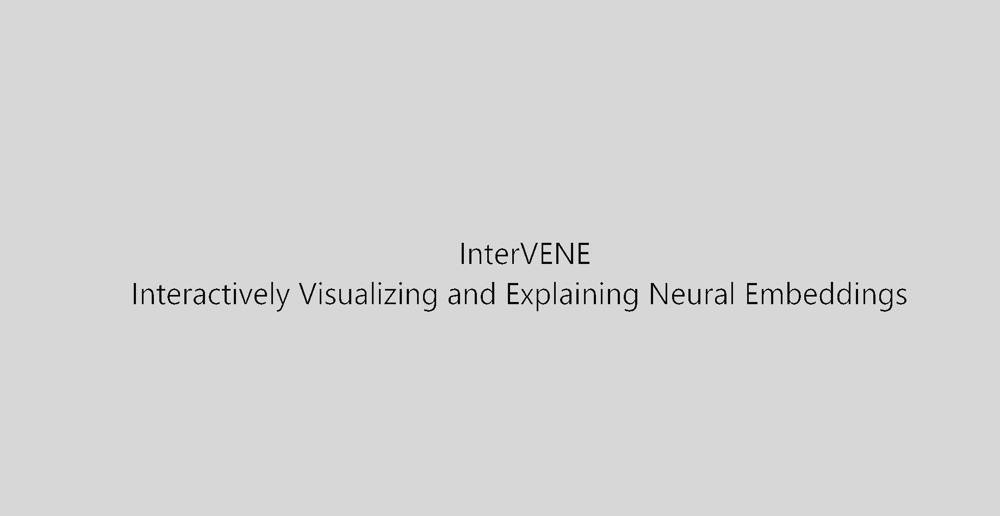

# InterVENE: Interactively Visualizing and Explaining Neural Embeddings

InterVENE is an approach that visualizes neural embeddings and interactively explains this visualization, aiming for knowledge extraction and network interpretation. 

InterVENE is presented in the paper "Interactive Explanations of Internal Representations of Neural Network Layers: An Exploratory Study on Outcome Prediction of Comatose Patients". 
The corresponding paper will be published at the 5th International Workshop on Knowledge Discovery in Healthcare Data [KDH 2020](https://sites.google.com/view/kdh-2020/home), held in conjunction with ECAI 2020.

## Functionality

* InterVENE trains a neural network on tabular data, and projects the neural embeddings in a 2-dimensional scatter plot (using [UMAP](https://umap-learn.readthedocs.io/en/latest/) as dimension reduction technique).
* The user can interactively select two clusters of interest, by either lasso selection with a mouse and/or using predefined buttons.
* A personalized decision tree is trained to distinguish these two clusters, thus explaining the visualization.

## Prerequisites
Check out the Jupyter notebook to see the implementation of InterVENE. Since the dataset used in our paper is confidential, the notebook applies InterVENE to a UCI dataset for demonstration purposes.

### General
* Python 3
* Jupyter
* [PyTorch](https://pytorch.org/get-started/locally/) >= 0.4

### Required Python Packages:
* Matplotlib
* [UMAP](https://umap-learn.readthedocs.io/en/latest/)
* Sci-kit learn
* graphviz
* numpy
* random
* [PMLB](https://github.com/EpistasisLab/penn-ml-benchmarks) for fetching the demo dataset
